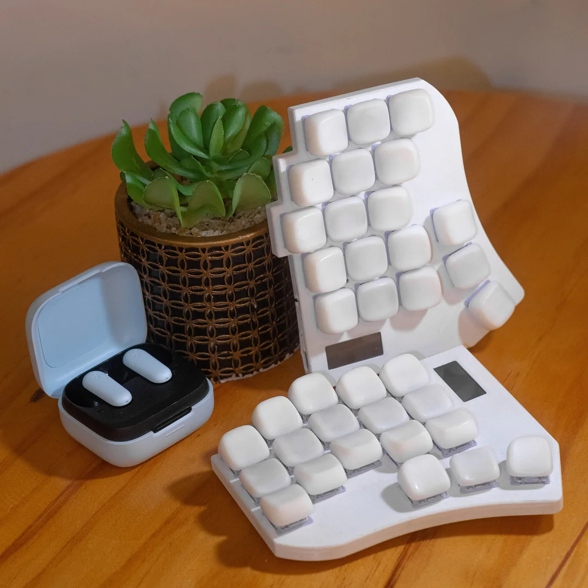
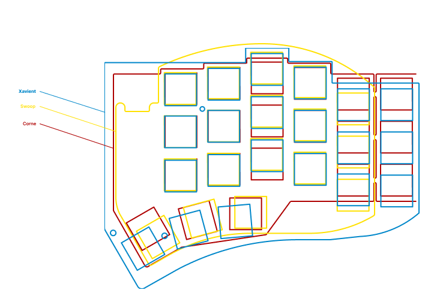
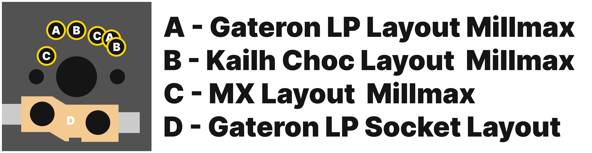
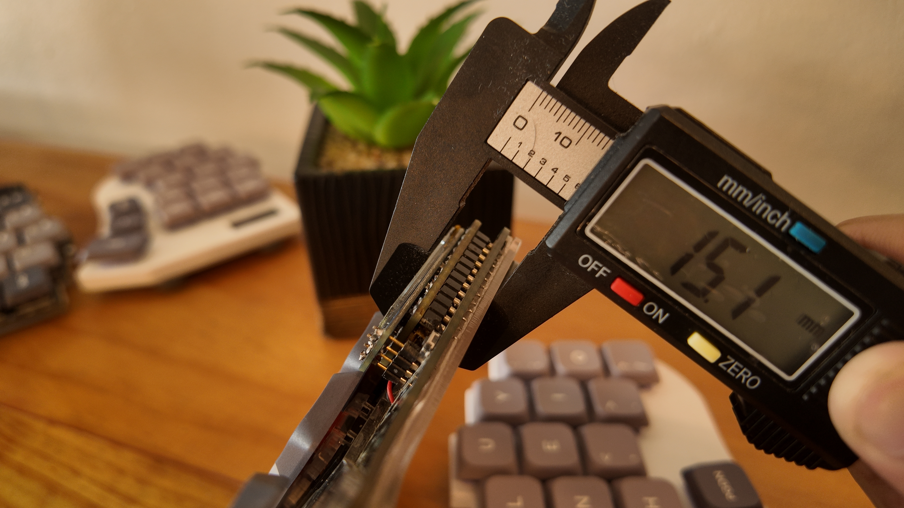
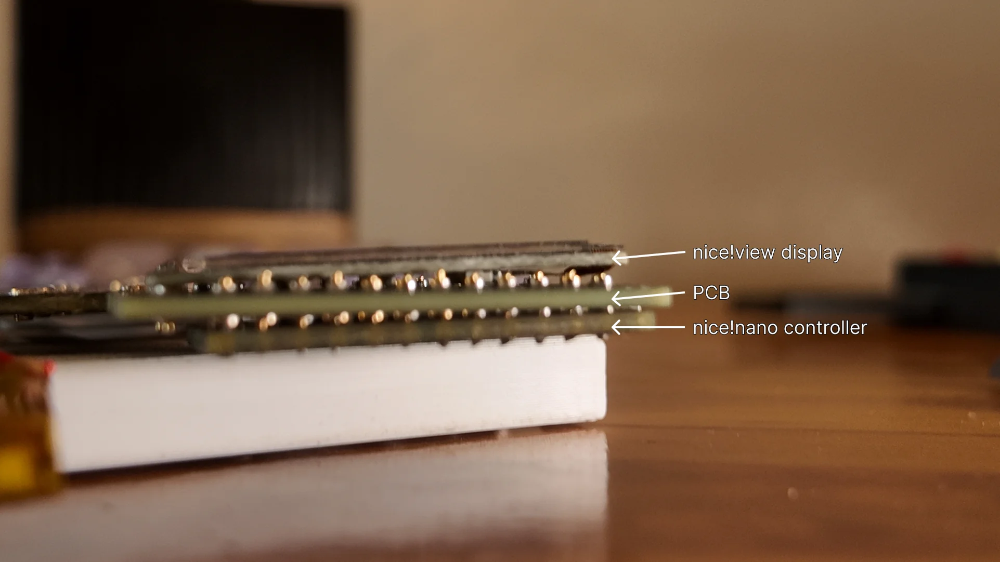
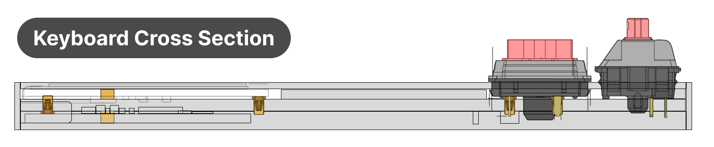

    <h1>XAVIENT Keyboard</h1> 
    
    <h4>An open-sourced split ergonomic keyboard focusing on repairability and sleek thin design.</h4>
    
<i>still a work in progress</i>

## Goal

The goal for this keyboard is to make a thin keyboard without sacrificing repairability or upgradablility. Taking inspiration from the Corne-ish Zen build but with hotswappable components.

## Main Features

- **User Repairable:** Controllers, Displays, and batteries are replaceable without the need of unsoldering the components.
- **Multi-Switch Compatibility:** Using Hotswappable Sockets compatible for **MX** and **Kailh LP** (*using millmax 7305 sockets*) and **Gateron LP** (*using both millmax 7305 and Gateron LP sockets*)
- **Two Layout Options:** available as a 36 key layout and a 42 key layout (52 key layout on-going development)
- **Large Battery Capacity** 2 allocated battery slots with each slot having  a 250mah maximum battery capacity
- **Thin Profile:** Achieved a 8mm thick keyboard by having a sandwiched layout for the controller and display.
- **Upgradability:** Future expansion to a Trackpoint [WIP] (will take up one battery slot)

## Keyboard Layout Comparisons
The placement of the keys for this keyboard are loosely based on both the Crkbd (Corne) and Swoop Keyboards. The crkbd keyboard is one of the most popular keyboards in the space hence the layout for the microcontroller for this keyboard followes the one design in the Corne Keyboard for easier compatibility of existing softwares. The swoop keyboard was my introduction to the split mechanical keyboards which lead me to making various keyboard such as this. 

## The Whys and Hows

### Repairability

During various iterations at building a keyboard the first things that I encountered various issues that led me building this keyboard. One of those things were with regards to the controller layout. The usual route was to have the Pro-Micro/NiceNano be mounted on [Mill Max Low Profile Sockets](https://splitkb.com/products/mill-max-low-profile-sockets?srsltid=AfmBOorAvRTDPpa_qCGRBX-qHv9DB7s7FVfZZd7idIL-V0db0YljPTJA) or straight to surface mounted PCBs.

- **Mill Max Low Profile Sockets:** This allows the battery to be sandwiched between the PCB and the Microcontroller. Add the display on top of the microcontroller and you have a thick stack of components.
  - *Repairability*: 5/5 - easily hotswap components.
  - *Looks*: 2/5 - open case design which is cheaper (prefer an enclosed case).
  - *Complexity*: 2/5 - beginner/budget friendly.
  - *Modularity*: 5/5 - option to convert builds from wired to wireless.
    Some examples of this are the Swoop Keyboard, Corne v4, and various other open-sourced keyboards.
- **Surface-mounted PCB:** This allows the pcb to be thin but will require a dedicated case and different pcb designs for wired and wireless builds.
  - *Repairability*: 1/5 - components are tiny and hard to hand solder.
  - *Looks*: 4/5 - often designed to have an enclosed case.
  - *Complexity*: 2/5 - not beginner/budget friendly due to the complexity.
  - *Modularity*: 1/5 - separate builds for wired and wireless.
    Some examples of this are the Corne-ish Zen Keyboard, Corne KBD (main branch), Seeed Xiao-based keyboards and various other keyboards from various sellers.

Xavient tries to combine the best features of both worlds into one. The solution is to use 7305  Millmax Sockets not just for key switches but for the controller and display as well. This saves space height-wise and adds a better space for bigger batteries. 

### Multi-Switch Compatibility
There are a lot of mechanical switches in the space and choosing one sometimes is a daunting task. During my experimentation, I locked myself into soldering key switches. This effectively removed the option to try other switches and is a nightmare to repair. Having the option of what key switches to use is a pesonal preference and gives you an opportunity to explore various switches at little to no time.

A dedicated switch plate is required as an additional part when using the keyboard with MX switches. This is done to provide stability to the switches. Both MX switches and Choc switches require Mill-Max Sockets. While Gateron LP switches have the option of using Mill-Max Sockets or the Gateron LP sockets.

For more switch options in the future, build the keyboard with B, C, and D layouts.

### Long Battery Life
While the case is designed to be thin, it does not compromise battery capacity. Each half can accommodate upto 250 mah batteries for longer runtime. There is also an option for a 2 battery slot in each , this utilizes the slot intended for a trackpoint.

### Thin Profile
This keyboard is around **8mm** (*body only*) thin without having a lot of compromises. This means having displays, larger batteries, and hotswappable components. This is achieved by having the microcontroller and displays as close as possible to the pcb with out soldering which in turn makes it modular.

Various keyboard uses Mill Max Low Profile Sockets for the controller. The layers are composed of the pcb, sockets and battery, microcontroller, and oled display. This stack of components (includes acrylic casing) while modular is around 15 mm in height. Add in an acrylic cover on top and it would add another 1.5 mm.

Instead of pins or directly soldering the microcontroller, mill max sockets intended for key switches were utilized for the microcontrollers and displays. This way, the components are as close to the pcb without being soldered. 

Having the pcb sandwiched in between the display and microcontroller achieves around 6mm in thickness.

### Compromises
While the goal of 8mm thick modular build was achieved, it is not without its compromises.

**PCB Layout:** To achieve the sandwiched layout, it sacrifices the reversable PCB layout that some custom keyboards have.

**Battery Placement:** With the space in between the PCB and microcontroller gone, a dedicated space was needed for the battery. This was also a blessing in disguise since it allowed bigger battery capacity which provides longer runtime.

**Dedicated Case:** Due to the tight constraints of this build, a dedicated case is required for this layout to work.

### Future Implementations
**PCB Development:** The current pcb was developed for the possibility of adding a trackpoint, hence it requires some of the keys to use mill max sockets. The use of mill-max sockets also allowed the pcb to be complatible for MX, and LP switches from Gateron to Kailh. However, having the full flexibility being able to swap from various switches will add to the cost of the build significantly. A new board will be designed to address this issue. It will have Hot-swap sockets for both kailh low profile and MX switches. Gateron LP v3 are compatible with MX switch pin layout hence will reduce the cost further but with the same implementation. (This will lose the trackpoint functionality.)

**Seeed Xiao Build:** The current keyboard layout uses the Nice!NanoV2/ProMicro microcontroller layout. The Seeed Xiao is one of the famous microcontrollers in the keyboard space that is in the middle of the nice!nanov2 and its clones price-wise. It will need some more time to build this keyboard with the same philisophy of the current build. Thin. Modular. Repairable. (This will lose the trackpoing functionality.)

**Pointing Devices:** There are already implementations for pointing devices in various zmk keyboards, but these still remain experimental at this time, however the pcb already has a provision for a trackpoint. 

Other pointing devices such as trackballs and trackpads will still need more time to develop.

**Case Alternatives:** The current case uses heat set inserts which provides a clean look on the top of the keyboard. The usual route is to have the case and pcb sandwiched by 2 screws and a brass threaded pillar. Acrylic cases can also be designed as an alternative, will require further testing.

**Unibody Keyboard:** This will provide another layout for users to choose from. 

## Notes
**[Wired Build:](https://github.com/duanexavierbondad/xavient-kbd/tree/main/pcb/Wired)** This is still under development and untested. Proceed at your own risk.

**[Software:](https://github.com/duanexavierbondad/zmk-config-xavien/tree/stable/xavient)** The software for this keyboard is available. You can also opt for the build with ZMK Studio [here](https://github.com/duanexavierbondad/zmk-config-xavien/tree/stable/xavient_zmk-studio).

## Credits
This keyboard build followed some inspirations on various open-sourced keyboards listed below:

- [Corne](https://github.com/foostan/crkbd): basing the footprint of the controller here since this is the most common keyboard.
- [Swoop](https://github.com/jimmerricks/swoop): used as my first keyboard when I was exploring the world of split-keyboards
- [Flake](https://github.com/anywhy-io/flake): got some inspiration on how to implement jst battery connections and MX switches mounting.
- [TPS42](https://github.com/crehmann/TPS42): basis for the trackpoint routing and mounting.

Some Close-sourced keyboards:

- [Sweet-Corne](https://imgur.com/a/sweep-corne-gjZDgmk): My first attempt at building a keyboard from scratch. (Lost Files)
- [Corne-ish Zen](https://lowprokb.ca/products/corne-ish-zen): A thin split keyboard with e-ink displays. (Sold Out)