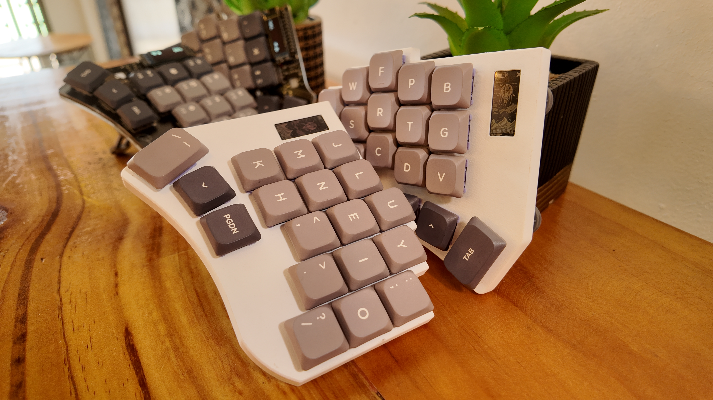

# XAVIENT Keyboard

    
    <h3>An Expensive but Amazing Journey</h3>
    
<i>still work in progress</i>

This keyboard build followed some inspirations on various open-sourced keyboards listed below:

- [Corne](https://github.com/foostan/crkbd): basing the footprint of the controller here since this is the most common keyboard.
- [Swoop](https://github.com/jimmerricks/swoop): used as my first keyboard when I was exploring the world of split-keyboards
- [Flake](https://github.com/anywhy-io/flake): got some inspiration on how to implement jst battery connections.
- Sweet-Corne: My first attempt at building a keyboard from scratch. (Lost Files)

The placement of the keys for this keyboard are loosely based on both the Corne and Swoop Keyboards. 

# The Goal
When I started using the Swoop Keyboard, I immediately knew that I wanted to go for a low profile version. This led me to create my first custom design based on the Swoop Keyboard by altering the pinky column stagger and adding underglow RGB. 

