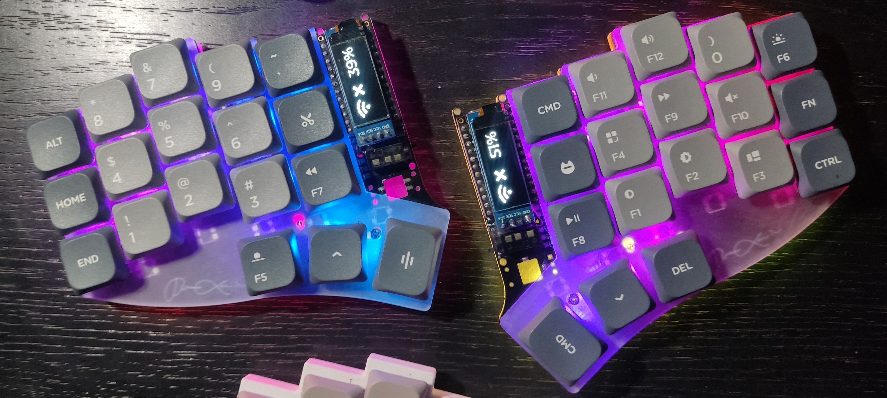

# XAVIENT Keyboard

    
    <h3>An Expensive but Amazing Journey</h3>
    
<i>still work in progress</i>

This keyboard build followed some inspirations on various open-sourced keyboards listed below:

- [Corne](https://github.com/foostan/crkbd): basing the footprint of the controller here since this is the most common keyboard.
- [Swoop](https://github.com/jimmerricks/swoop): used as my first keyboard when I was exploring the world of split-keyboards
- [Flake](https://github.com/anywhy-io/flake): got some inspiration on how to implement jst battery connections.

Some Close-sourced keyboards:
- [Sweet-Corne](https://imgur.com/a/sweep-corne-gjZDgmk): My first attempt at building a keyboard from scratch. (Lost Files)
- [Corne-ish Zen](https://lowprokb.ca/products/corne-ish-zen): A thin split keyboard with e-ink displays. (Sold Out)

The placement of the keys for this keyboard are loosely based on both the Corne and Swoop Keyboards. 

# Goal
The goal for this keyboard is to make a thin keyboard without sacrificing repairability or upgradablility. Taking inspiration from the Corne-ish Zen build but with hotswappable components.

# Features
- Replaceable Displays and Controllers
- Multi Switch Compatibility
- Hot-Swappable Sockets
- Two Battery Slot for each slot
- Future expansion to a Trackpoint (Will forgo a Battery Slot)

# Backstory
When I started using the Swoop Keyboard, I immediately knew that I wanted to go for a low profile version. This led me to create my first custom design based on the Swoop Keyboard by altering the pinky column stagger and adding underglow RGB. I called it the Sweet-Corne. 

    
    <h4>Sweet-Corne Keyboard</h4>
    
uses QMK firmware

This build is about 8 mm thin but forgoing the RGB and going wireless made it even thinner at 6.5 mm. The issue however is the controller stack where in the battery is sandwiched between the pcb and mcu. This is not really an issue for most since a 110mah battery is more than enough and it does not require a case. But for me, this makes the stack thicker, epecially when you plan to add displays for the keyboard. This pointed me to use the Seeed Xiao for a new set of design for my goals of making a thin keyboard. But initial testing of the designs pointed an issue 

