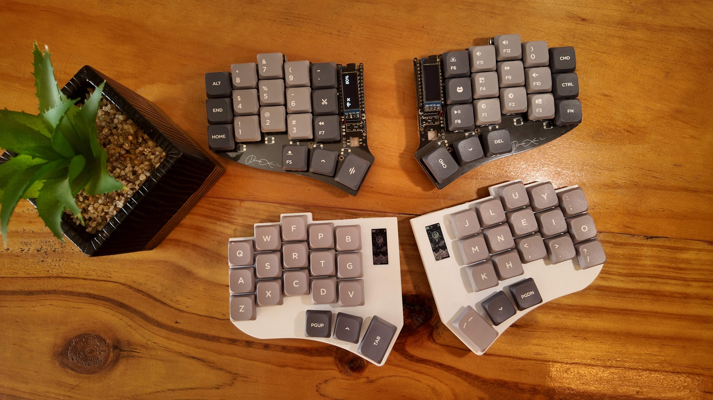

> ⚠️ The case and this build guide is still a work in progress.

# Building Xavien Keyboard

    

## Components

To build this keyboard you need the following materials

| Name                        | Count    | Remarks                                                  | Links                                                                                                                                                 |
| :-------------------------- | :------- | :------------------------------------------------------- | :---------------------------------------------------------------------------------------------------------------------------------------------------- |
| PCB                         | 1 set    |                                                          | [download here](https://github.com/yyevax/xavient-kbd/tree/main/pcb/gerber.zip)                                                                                                                       |
| Case                        | 1 set    | 3D printed with FDM or Resin                             | [36 Key](https://github.com/yyevax/xavient-kbd/tree/main/case/3x5) or [42 Key](https://github.com/yyevax/xavient-kbd/tree/main/case/3x6)                                                                                                                       |
| Nice!View Displays          | 2 set    | Required for Case with Display Hole                      | [Aliexpress](https://tinyurl.com/niceviewdisplay) or [Official](https://tinyurl.com/officialniceview)                                                       |
| Gateron LP hot-swap sockets | 36 or 42 | Default sockets used.                                    | [Aliexpress](https://tinyurl.com/gateronLPsockets) or [Shopee](https://tinyurl.com/ShopeeGateronLPsockets)                                                  |
| Millmax Sockets             | 58       | Used for MCU and Nice!View Displays                      | [Aliexpress](https://tinyurl.com/7305millmax) or [Shopee](https://tinyurl.com/7305MillmaxnShopee)                                                           |
| Millmax Sockets (Optional)  | 72 or 84 | Used for MX or Choc Switches (Optional)                  | [Aliexpress](https://tinyurl.com/7305millmax) or [Shopee](https://tinyurl.com/7305MillmaxnShopee)                                                           |
| Diodes                      | 36 or 42 | 1N4148 Diodes                                            | [Aliexpress](https://tinyurl.com/t4-diodes) or [Shopee](https://tinyurl.com/ShopeeDiodes)                                                                   |
| Switches                    | 36 or 42 | Gateron Low Profile Switches                             | [Aliexpress](https://tinyurl.com/gateronLPswitches) or [Nuphy](https://tinyurl.com/nuphyWisteriaLP) or [Shopee](https://tinyurl.com/GateronLPshopee)           |
| Switches (Optional)         | 36 or 42 | Choc v1/v2 or MX Switches (*Millmax Sockets Required*) | [GateronLP v3 Nuphy](https://tinyurl.com/gateron-LP3) or [Choc v2](https://tinyurl.com/lofreeChocV2) or [Gateron Yellows](https://tinyurl.com/gateronSwitches) |
| Keycaps                     | 36 or 42 | Compatible with your switches                            | [KLP Lame](https://tinyurl.com/KLP-LameKeycaps)                                                                                                          |
| Controllers                 | 2        | Nice!Nano v2, NRF52840 ProMicro                          | [Nice!Nano V2](https://tinyurl.com/NiceNanoOfficial) or [Clone](https://tinyurl.com/NiceNanoClone) [Shopee](https://tinyurl.com/ShopeeNiceNanoClone)           |
| Reset buttons               | 2        | YD-3414 4Pin SMD Switch                                  | [Aliexpress](https://tinyurl.com/YD-3414) or [Shopee](https://tinyurl.com/ShopeeResetSwitch)                                                                |
| M2 Screws                   | 8        | M2 - 6mm(height) x 4mm                                   | [Aliexpress](https://tinyurl.com/M2-6mmScrew) or [Shopee](https://tinyurl.com/ShopeeScrew)                                                                  |
| M2 Threaded Heat Inserts    | 8        | M2 3.5OD - 2mm(Height)                                   | [Aliexpress](https://tinyurl.com/HeatSetInserts) or [Shopee](https://tinyurl.com/ShopeeThreadedInserts)                                                     |
| Rubber Feet                 | 8        | Circle around 8mm in diameter                            | [Aliexpress](https://tinyurl.com/KeebRubberFeets) or [Shopee](https://tinyurl.com/ShopeeRubberFeets)                                                        |
| Tenting Feet                | 4        | Optional.                                                | [Aliexpress](https://tinyurl.com/tentingFeet) or [Shopee](https://tinyurl.com/ShopeeTentingFeet)                                                            |
| Battery sockets             | 2 or 4   | JST 1.25 with the straight needle                        | [Aliexpress](https://tinyurl.com/JST-2pin-Straight) or [Shopee]()                                                                                           |
| Batteries                   | 2 or 4   | 602030 (or smaller) with JST 1.25                        | [Aliexpress](https://tinyurl.com/600mahBattery) or [Shopee](https://tinyurl.com/Shopee2030Battery)                                                          |

## Step 1
